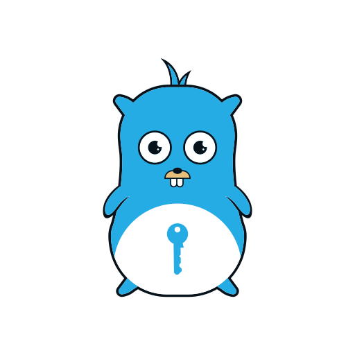

<!--
SPDX-FileCopyrightText: 2021-2024 Winni Neessen <wn@neessen.dev>

SPDX-License-Identifier: CC0-1.0
-->

# A "Automated Password Generator"-clone
[](https://pkg.go.dev/github.com/wneessen/apg-go) 
[](https://goreportcard.com/report/github.com/wneessen/apg-go)
[](https://codecov.io/gh/wneessen/apg-go)
[](https://discord.gg/ysQXkaccXk)
[](https://api.reuse.software/info/github.com/wneessen/apg-go)
[](https://www.bestpractices.dev/projects/8677)
<a href="https://ko-fi.com/D1D24V9IX"></a>

<p align="center"></p>

_apg-go_ is a simple APG-like password generator written in Go. It tries to replicate the
functionality of the
"[Automated Password Generator](https://web.archive.org/web/20130313042424/http://www.adel.nursat.kz:80/apg)",
which hasn't been maintained since 2003. Since more and more Unix distributions are abandoning the tool, I was
looking for an alternative. FreeBSD for example recommends "security/makepasswd", which is written in Perl
but requires a lot of dependency packages and doesn't offer the feature-set/flexibility of APG.

Since FIPS-181 (pronounceable passwords) has been withdrawn in 2015, apg-go does not follow this standard. Instead,
it implements the [Koremutake Syllables System](https://shorl.com/koremutake.php) in its pronounceable password mode.

## Examples
This section provides some examples on how to use apg-go for common password generation tasks.

### Login password for a website
```shell
$ apg-go -C -f 20 -n 1
Zq#lIY?=?J@4_\X@\xtf
```
**Note:** Nowadays 20 random characters are still considered secure for passwords. You might want to adjust
the `-f` parameter if you require a longer password.

### PIN generation
```shell
$ apg-go -M lusN -f 6 -n 1
952170
```
**Note:** A code example on how to programatically build a PIN generator with apg-go, can be found
here: [pin-generator](example-code/pin-generator).

### Phone verification phrase (pronounceable)
```shell
$ apg-go -a 0 -m 15 -x 15 -t -n 1
vEbErlaFryaNgyex (vE-bEr-la-Fry-aN-gy-ex)
```
We generated a 15-character long pronounceable phrase with syllables output, for easy
use in e. g. a phone verification process.

### Cryptographic key for encryption
```shell
$ apg-go -a 3 -f 32 -bh
```
We generated a 32 bytes/256 bits long fully binary secret that can be used i. e. as
encryption key for a AES-256 symmetric encryption. The output is represented in 
hexadecimal format.

## Installation

### Docker
There is a ready-to-use Docker image hosted on Github.

* Download the image:
  ```shell
  $ docker pull ghcr.io/wneessen/apg-go:main
  ```
* Run the image:
  ```shell
  $ docker run ghcr.io/wneessen/apg-go:main
  ```
  
### Go install
apg-go can be installed using the `go install` command if you have Go installed on your system. This requires
that you have Go installed on your system and that your Go version matches or is higher than the version
required in `go.mod`. You can install various versions using `go install`.

* Verify your Go version
  ```shell
  $ go version
  go version go1.22.1 linux/amd64
  ```
  **Note: Make sure that your Go version matches the requirements of apg-go.**
* Install the latest version of apg-go
  ```shell
  $ go install github.com/wneessen/apg-go/cmd/apg@latest
  ```
  The `latest` tag will always install the latest release. If you want to run a different version you can replace 
  the `latest` with the requested version (i. e. `v1.1.0`). Alternatively if you want to test the latest code, not
  fully released code from the main branch, you can replace `latest` with `main`.
* Execute apg-go
  Once the `go install` command completed without errors, your apg-go binary will be installed into your Go project 
  workspace or your `$GOPATH/bin` directory (i. e. `/home/ttester/go/bin`). If this directory is
  part of your `$PATH` environment, you can just execute it via the `apg` command, otherwise you'll need to 
  specify the full path: `/home/ttester/go/bin/apg`.
  ```shell
  $ /home/ttester/go/bin/apg -v
  apg-go // A "Automated Password Generator"-clone v1.2.0
  OS: linux // Arch: amd64
  (C) 2021-2024 by Winni Neessen
  ```

### Binary releases/Packages
On the [Github release page](https://github.com/wneessen/apg-go/releases) you will always find pre-build binaries
for all supported OS and architectures. You will also find pre-built packages for the most common Linux distributions.
Each file is digitally signed via GPG. After downloading the corresponding file, make sure that the file is verified
with the GPG signature. The public GPG key is:
["Winni Neessen" (Software signing key) <wn@neessen.dev>](https://keys.openpgp.org/vks/v1/by-fingerprint/10B5700F5ECCB06532CEC873C3D38948DA536E89)

#### FreeBSD
apg-go can be found as `/security/apg` in the [FreeBSD ports](https://cgit.freebsd.org/ports/tree/security/apg)
tree.
#### Arch Linux
Find apg-go in [Arch Linux AUR](https://aur.archlinux.org/packages/apg-go/). Alternatively use the pre-build `zst`-package of the [latest release](https://github.com/wneessen/apg-go/releases) in 
this git repository
#### Debian/Redhat/Alpine
Pre-build packages in `.deb`, `.rpm` and `.apk` format can be found on [release page](https://github.com/wneessen/apg-go/releases) in
this git repository

#### Binary installation on Linux/BSD/MacOS
* Download release
  ```sh
  $ curl -LO https://github.com/wneessen/apg-go/releases/download/v<version>/apg-go_<version>_<os>_<architecture>.tar.gz
  $ curl -LO https://github.com/wneessen/apg-go/releases/download/v<version>/apg-go_<version>_<os>_<architecture>.tar.gz.sig
  ```
* Import the GPG signing key
  ```sh
  $ gpg --keyserver keys.openpgp.org --recv-keys C3D38948DA536E89        
  gpg: key C3D38948DA536E89: public key "Winni Neessen (Software signing key) <wn@neessen.dev>" imported
  gpg: Total number processed: 1
  gpg:               imported: 1
  ```
* Verify the signature
  ```sh
  $ gpg --verify apg-go_<version>_<os>_<architechture>.tar.gz.sig apg-go_<version>_<os>_<architecture>.tar.gz
  gpg: Signature made Thu Mar 14 11:27:43 2024 CET
  gpg:                using EDDSA key 10B5700F5ECCB06532CEC873C3D38948DA536E89
  gpg:                issuer "wn@neessen.dev"
  gpg: Good signature from "Winni Neessen (Software signing key) <wn@neessen.dev>" [unknown]
  Primary key fingerprint: 10B5 700F 5ECC B065 32CE  C873 C3D3 8948 DA53 6E89
  ```
  **Make sure the signature of the downloaded file verifies as "good"**
* Extract archive
  ```sh
  $ tar xzf apg-<version>_<os>_<architecture>.tar.gz
  ```
* Execute
  ```sh
  $ ./apg -v
  apg-go // A "Automated Password Generator"-clone v1.0.0
  OS: <version> // Arch: <architecture>
  (C) 2021-2024 by Winni Neessen
  ```
#### Windows
* Download release
  ```PowerShell
  PS> Invoke-RestMethod -Uri https://github.com/wneessen/apg-go/releases/download/v<version>/apg-go_<version>_windows_<architecture>.zip -OutFile apg-<version>-windows-<architecure>.zip
  PS> Invoke-RestMethod -Uri https://github.com/wneessen/apg-go/releases/download/v<version>/apg-go_<version>_windows_<architecture>.zip.sig -OutFile apg-<version>-windows-<architecure>.zip.sig
  ```
* Import the GPG signing key
  ```PowerShell
  PS> gpg --keyserver keys.openpgp.org --recv-keys C3D38948DA536E89        
  gpg: key C3D38948DA536E89: public key "Winni Neessen (Software signing key) <wn@neessen.dev>" imported
  gpg: Total number processed: 1
  gpg:               imported: 1
  ```
* Verify the signature
  ```PowerShell
  PS> gpg --verify apg-go_<version>_<os>_<architechture>.tar.gz.sig apg-go_<version>_<os>_<architecture>.tar.gz
  gpg: Signature made Thu Mar 14 11:27:43 2024 CET
  gpg:                using EDDSA key 10B5700F5ECCB06532CEC873C3D38948DA536E89
  gpg:                issuer "wn@neessen.dev"
  gpg: Good signature from "Winni Neessen (Software signing key) <wn@neessen.dev>" [unknown]
  Primary key fingerprint: 10B5 700F 5ECC B065 32CE  C873 C3D3 8948 DA53 6E89
  ```
  **Make sure the signature of the downloaded file verifies as "good"**
* Extract archive
  ```PowerShell
  PS> Expand-Archive -LiteralPath apg-<version>-windows-<architecture>.zip
  ```
* Execute
  ```PowerShell
  PS> apg.exe
  ```

### Sources
* Download sources
  ```shell
  $ curl -LO https://github.com/wneessen/apg-go/archive/refs/tags/v<version>.tar.gz
  ```
* Extract source
  ```shell
  $ tar xzf v<version>.tar.gz
  ```
* Download dependencies
  ```shell
  $ cd apg-go-<version>
  $ go mod tidy
  $ go mod download
  $ go mod verify
  ```
* Build binary
  ```shell
  $ go build -o apg github.com/wneessen/apg-go/cmd/apg
  ```
* Execute the brand new binary
  ```shell
  $ ./apg
  ```

### Systemwide installation
It is recommed to install apg in a directory of your ```$PATH``` environment. To do so run:
(In this example we use ```/usr/local/bin``` as system-wide binary path. YMMV)
```sh
$ sudo cp apg /usr/local/bin/apg
```

## Programmatic interface
Since v1.0.0 the CLI and the main package functionality have been separated from each other, which makes
it easier to use the `apg-go` package in other Go code as well. This way you can make of the password
generation in your own code without having to rely on the actual apg-go binary.

A code example on how to use the package can be found in the [example-code](example-code) directory.

## Usage examples
### Default behaviour
By default apg-go will generate 6 passwords, with a minimum length of 12 characters and a 
maxiumum length of 20 characters. The generated password will use a character set constructed 
from lower case, upper case and numeric characters.
```shell
$ apg-go
R8rCC8bw5NvJmTUK2g
cHB9qogTbfdzFgnH
hoHfpWAHHSNa4Q
QyjscIsZkQGh
904YqsU5SnoqLo2w
utdFKXdeiXFzM
```
### Modifying the character sets
#### Old style
Let's assume you want to generate a single password, constructed out of upper case, numeric
and special characters. Since lower case is part of the default set, you would need to disable them
by setting the `-L` parameter. In addition you would set the `-S` parameter to enable special 
characters. Finally the parameter `-n 1` is needed to keep apg-go from generating more than one
password:
```shell
$ apg-go -n 1 -L -S
XY7>}H@5U40&_A1*9I$
```

#### New/modern style
Since the old style switches can be kind of confusing, it is recommended to use the "new style" 
parameters instead. The new style is all combined in the `-M` parameter. Using the upper case
version of a parameter argument enables a feature, while the lower case version disabled it. The
previous example could be represented like this in new style:
```shell
$ apg-go -n 1 -M lUSN
$</K?*|M)%8\U$5JA5~
```

#### Human readability
Generated passwords can sometimes be a bit hard to read for humans, especially when ambiguous 
characters are part of the password. Some characters in the ASCII character set look similar to 
each other. In example it can be hard to differentiate an upper case I from a lower case l. 
Same applies to the number zero (0) and the upper case O. To not run into issues with human 
readability, you can set the `-H` parameter to toggle on the "human readable" feature. When the
option is set, apg-go will avoid using any of the typical ambiguous characters in the generated
passwords.
```shell
$ apg-go -n 1 -M LUSN -H
YpranThY3b6b5%\6ARx
```

#### Character exclusion
Let's assume, that for whatever reason, your generated password can never include a colon (:) sign. For
this specific case, you can use the `-E` parameter to specify a list of characters that are to be excluded 
from the password generation character set:
```shell
$ apg-go -n 1 -M lUSN -H -E :
~B2\%E_|\VV|/5C7EF=
```

#### Complex passwords
If you want to generate complex passwords, there is a shortcut for this as well. By setting the `-C`
parameter, apg-go will automatically default to the most secure settings. The complex parameter 
basically implies that the password will use all available characters (lower case, upper case, 
numeric and special) and will make sure that human readability is disabled.
```shell
$ apg-go -n 1 -C
{q6cvz9le5_fo"X7
```

### Password length
By default, apg-go will generate a password with a random length between 12 and 20 characters. If you
want to be more specific, you can use the `-m` and `-x` parameters to override the defaults. Let's 
assume you want a single complex password with a length of exactly 32 characters you can do so by
running:
```shell
$ apg-go -n 1 -C -m 32 -x 32
5lc&HBvx=!EUY*;'/t&>B|~sudhtyDBu
```
Alternatively, since v1.0.0 apg-go has the new `-f` flag, which allows to request a fixed length
password. Instead of using `-m` and `-x` you can just use `-f 32` to get a 32 character long password:
```shell
$ apg-go -n 1 -C -f 32
O"Q\d0zT'@(1f~%_56O*!q[!9:z[~\A*
```

### Password spelling
If you need to read out a password, it can be helpful to know the corresponding word for that character in
the phonetic alphabet. By setting the `-l` parameter, agp-go will provide you with the phonetic spelling 
(english language) of your newly created password:
```shell
$ apg-go -n 1 -M LUSN -H -E : -l
fUTDKeFsU+zn3r= (foxtrot/Uniform/Tango/Delta/Kilo/echo/Foxtrot/sierra/Uniform/PLUS_SIGN/zulu/november/THREE/romeo/EQUAL_SIGN)
```

### Pronouncable passwords
Since v0.4.0 apg-go supports pronounceable passwords, anologous to the original c-apg using the `-a 0`
flag. The original c-apg implemented FIPS-181, which was withdrawn in 2015 for generating pronounceable
passwords. Since the standard is not recommended anymore, `apg-go` instead make use of the
[Koremutake Syllables System](https://shorl.com/koremutake.php). Similar to the original apg, `agp-go`
will automatically randomly add special characters and number (from the human-readable pool) to each
generated pronounceable password. Additionally it will perform a "coinflip" for each Koremutake syllable
and decided if it should switch the case of one of the characters to an upper-case character.

Using the `-t` parameter, `apg-go` will display a spelled out version of the pronounceable password, where
each syllable or number/special character is seperated with a "-" (dash) and if the syllable is not a
Koremutake syllable the character will be spelled out the same was as with activated `-l` in the
non-pronounceable password mode (`-a 1`).

**Note on password length**: The `-m` and `-x` parameters will work in prouncable password mode, but
please keep in mind, that due to the nature how syllables work, your generated password might exceed 
the desired length by one complete syllable (which can be up to 3 characters long).

**Security consideration:** Please keep in mind, that pronounceable passwords are less secure compared to truly
randomly created passwords, due to the nature how syllables work. As a rule of thumb, it is recommended
to multiply the length of your generated pronounceable passwords by at least 1.5 times, compared to truly
randomly generated passwords. It might also be helpful to run the pronoucable password mode with enabled
"[HIBP](#have-i-been-pwned)" flag, so that each generated password is automatically checked against "Have I Been Pwned" 
database.
```shell
$ apg-go -a 0 -n 1
KebrutinernMy

$ apg-go -a 0 -n 1 -m 15 -x 15 -t
pEnbocydrageT*En (pEn-bo-cy-dra-geT-ASTERISK-En)
```

### Coinflip mode
Sometimes you just want to quickly perform a simple, but random coinflip. Since v1.0.0 apg-go has a 
coinflip mode, which will return either "Heads" or "Tails". To use coinflip mode, use the `-a 2` argument:
```shell
$ apg-go -n 10 -a 2
Tails
Tails
Heads
Heads
Tails
Tails
Tails
Tails
Heads
Heads
```

### Binary mode
Since v1.1.0 apg-go has a new algorithm for binary secrets. This is a very basic mode that will ignore
most of the available options, as it will only generate binary secrets with full 256 bits of randomness.
The only available options for this mode are: `-f` to set the length of the returned secret in bytes, 
`-bh` to tell apg-go to output the generated secret in hexadecial representation and `-bn` to instruct
apg-go to return a newline after the generated secret. Any other option available in the other modes
will be ignored.

This mode can be useful for example if you need to generate a AES-256 encryption key. Since 32 bytes is
the default length for the secret generation in this mode, you can simply generate a secret key with 
the following command:
```shell
$ apg-go -a 3 -bh
a1cdab8db365af3d70828b1fe43b7896190c157ad3f1ae2a0a1d52ec1628c6b5
```
*For ease for readability we used the `-bh` flag, to instruct apg-go to output the secret in its
hexadecimal representation*

### Mobile-friendly character grouping
Since v1.2.0 apg-go supports grouping of characters in a mobile-friendly manner. Entering a random string 
of characters with a smartphone touch screen is tedious and error prone due to the need to toggle keypads 
to gain access to different character tables. For this reason, this feature groups the characters of the
generated password in "keypad-order". It does so by groupoing the characters into character groups. The
following precedense is used: Upper-case characters, lower-case characters, numeric values, any other 
character.

Example:
```shell
$ apg-go -C -f 20 -n 1 -g
CETMPGGxuamj346!)>})
```

**Please note that this feature makes the generated passwords much more predictable and lowers the 
entropy of the generated password. Please use this feature with caution**

### Minimum required characters
Even though in apg-go you can select what kind of characters are used for the password generation, it is
not guaranteed, that if you request a password with a numeric value, that the generated password will 
actually have a numeric value. Since v1.0.0 apg-go has a new set of arguments, that let's you define
a minimum amount of characters of a specific character class to be included in the generated password.
This can be requested with the `-mL`, `-mN`, `-mS` and `-mU` arguments. Each stands for the corresponding
character class. If one of the arguments is give, apg-go will generate passwords until the requested amount
of characters of the corresponding class is given.

**Note on minimum characters**: Please keep in mind, that due to the way the "minimum amount" feature works,
the calculation time for passwords can increase and if the amount is set too high, it can result in apg-go
never being able to finish the job.

Example:
```shell
$ apg-go -n 10 -a 1 -M NLUs -f 20 -mN 3
kqFG935E280LvTFUbJ4M
RVBJAI5tJ6hy6oWrNfXG
uy1IWBEoOQFyG66VrLqu
T5k9oKieImvJ9hxePfHt
0TTpGzMUje6mU7IXaSII
gvDjPmlj8J6glR0iy0h4
C5OP3Ph7bx173v0gRNsn
SEuP7I3en6ai9OuHvNSs
yira1uPQ8qmo5OKUM4Er
bu0nzhjoKn8Uiy3H2RjD
```

### Have I Been Pwned
Even though, the passwords that apg-go generated for you, are secure, there is a minimal chance, that 
someone on the planet used exactly the same password before and that this person was part of an 
internet leak or hack, which exposed the password to the public. Such passwords are not considered 
secure anymore as they usually land on public available password lists, that are used by crackers.

To be on the safe side, you can use the `-p` parameter, to enable a HIBP check. When the feature is 
enabled, apg-go will check the HIBP database at https://haveibeenpwned.com if that password has been
leaked before and provide you with a warning if that is the case.

Please be aware, that this is a live check against the HIBP API, which not only requires internet
connectivity, but also might take between 500ms to 1s to complete. When you generating a bigger list
of password `-n 100`, the process could take much longer than without the `-p` feature enabled.

## CLI parameters
_apg-go_ replicates most of the parameters of the original c-apg. Some parameters are different though:

- `-a <algorithm>`: Choose password generation algorithm (Default: 1)
  - `0`: Pronouncable password generation (Koremutake syllables)
  - `1`: Random password generation according to password modes/flags
  - `2`: Coinflip (returns heads or tails)
  - `3`: Binary mode (returns a secret with 256 bits of randomness)
- `-bh`: When set, will print the generated secret in its hex representation (Default: off)
- `-bn`: When set, will return a new line character after the generated secret (Default: off)
- `-m <length>`: The minimum length of the password to be generated (Default: 12)
- `-x <length>`: The maximum length of the password to be generated (Default: 20)
- `-f <length>`: Fixed length of the password to be generated (Ignores -m and -x)
- `-g`: When set, mobile-friendly character grouping will be enabled in Algo: 1 (Default: off)
- `-n <number of passwords>`: The amount of passwords to be generated (Default: 6)
- `-E <list of characters>`: Do not use the specified characters in generated passwords
- `-M <[LUNSHClunshc]>`: New style password parameters (upper-case enables, lower-case disables)
- `-mL <number>`: Minimum amount of lower-case characters (implies -L)
- `-mN <number>`: Minimum amount of numeric characters (implies -N)
- `-mS <number>`: Minimum amount of special characters (implies -S)
- `-mU <number>`: Minimum amount of upper-case characters (implies -U)
- `-L`: Use lower-case characters in passwords (Default: on)
- `-U`: Use upper-case characters in passwords (Default: on)
- `-N`: Use numeric characters in passwords (Default: on)
- `-S`: Use special characters in passwords (Default: off)
- `-H`: Avoid ambiguous characters in passwords (i. e.: 1, l, I, o, O, 0) (Default: off)
- `-C`: Generate complex passwords (implies -L -U -N -S and disables -H) (Default: off)
- `-l`: Spell generated passwords in random password mode (Default: off)
- `-t`: Spell generated passwords in pronounceable password mode (Default: off)
- `-p`: Check the HIBP database if the generated passwords was found in a leak before (Default: off) // *this feature requires internet connectivity*
- `-h`: Show a CLI help text
- `-v`: Show the version number

## Contributors
Thanks to the following people for contributing to the apg-go codebase:
* [Romain Tartière](https://github.com/smortex)
* [Abraham Ingersoll](https://github.com/aberoham)
* [Vinícius Zavam](https://github.com/egypcio) (Maintaining the FreeBSD port)
